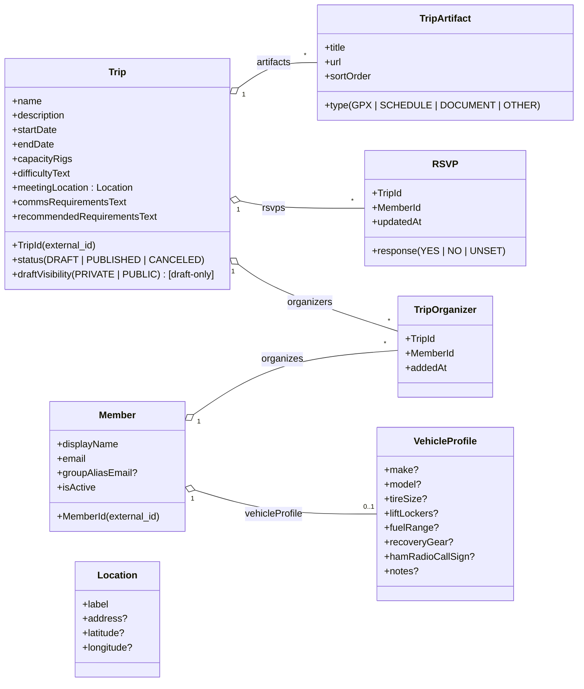

# Domain Model (v1) — Mermaid

Source of truth: `docs/Overland Trip Planning – v1 Domain Model & Use Case Catalog.md`

## Notes (v1)

- **Trip lifecycle**: `DRAFT -> PUBLISHED -> CANCELED` (publish only allowed from `DRAFT`).
- **Draft visibility**: only meaningful when `status = DRAFT`.
- **RSVP rules**:
  - Allowed only when `status = PUBLISHED`.
  - `YES` consumes exactly one “rig slot”; `NO`/`UNSET` do not.
  - Capacity is strictly enforced on transitions to `YES`.
- **Artifacts**: externally hosted; stored as URLs.

